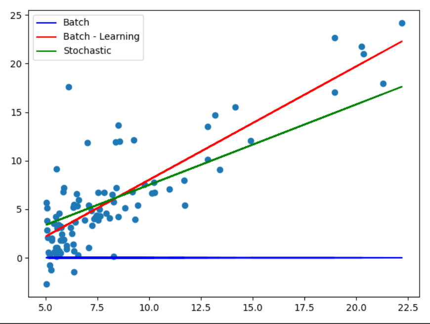

# Gradient Descent Algorithms

Gradient Descent and its Algorithms are the fundamental blocks of Machine Learning.
In order to get a deeper understanding on the concept of Gradient Descent, I have tried to implement
various forms of algorithms like Batch Gradient Descent and Stochastic Gradient Descent. 

## Installation

Use the package manager [pip](https://pip.pypa.io/en/stable/) to install following libraries.

```bash
pip install numpy
pip install matplotlib
```

## Usage

```python
# Importing Libraries to carry out the Operations
import numpy
import matplotlib.pyplot as plt
# Importing features from the Libraries to carry out the Operations
from numpy import loadtxt
```

# Code Initialization and Data Loading

```python
def __init__(self):
    # Training Examples File To be Loaded from a CSV/TXT file
    # Put Data Set Path
    data_path = r"/Data Sets/Housing_Problem_Basic_data_Set.txt"
    data_file = open(data_path, 'r')
    data = loadtxt(data_file, delimiter=',')
    self.x = data[:, [0]]
    self.y = data[:, [1]]

    # Defining the length of Training Set
    # Length of Input features should be equal to the Prediction/Output Data, else Raise Error
    if len(self.x) != len(self.y):
        raise TypeError("x and y should have same number of rows.")
    else:
        self.m = len(self.x)

    # Defining Theta
    self.theta = numpy.zeros([2, 1])

    # Creating a vector array of ones and adding this array as first column
    # of Input Features. This is done because in equation Theta(0)X(0), X(0) = 1
    ones = numpy.ones(self.m)[:, numpy.newaxis]
    self.x = numpy.hstack((ones, self.x))
```

## Comparison
### Batch Gradient Descent - No Learning Rate

```python
# This Cost Function is calculated using Batch Gradient Algorithm
def cost_function(self):
    # Now, calculating the hypothesis as Least Squared Method
    hypothesis = numpy.dot(self.x, self.theta)
    squared_error = numpy.square(hypothesis - self.y)

    # Calculating the Cost Function
    cost = (1/(2 * self.m)) * numpy.sum(squared_error)
``` 
### Batch Gradient Descent - With Learning Rate

```python
# This Cost Function is calculated using Batch Gradient Algorithm and Learning rate
def cost_function_with_learning_rate(self):
    for i in range(0, self.iterations):
        hypothesis = numpy.dot(self.x, self.theta)
        error = hypothesis - self.y
        squared_error = numpy.square(hypothesis - self.y)

        # Calculating Theta on every iteration based on Learning Rate
        self.theta = self.theta - (self.alpha/self.m) * numpy.dot(numpy.transpose(self.x), error)
        cost = (1/(2 * self.m)) * numpy.sum(squared_error)
```
### Stochastic Gradient Descent

```python
# This Cost Function is calculated using Stochastic Gradient Descent Algorithm and Learning rate
def stochastic_cost_function(self):
    # Iterating through each Data Set of the Training Sample
    for xx, yy in zip(self.x, self.y):
        hypothesis = numpy.dot(xx, self.theta)
        error = hypothesis - yy
        squared_error = numpy.square(hypothesis - yy)

        # Calculating Theta on for Single Data Set
        self.theta = self.theta - ((self.alpha * error * xx).reshape(-1,1))
        cost = (1 / (2 * self.m)) * numpy.sum(squared_error)
``` 
### Graph Plot for the Algorithms


## Contributing
Pull requests are welcome. For major changes, please open an issue first to discuss what you would like to change.